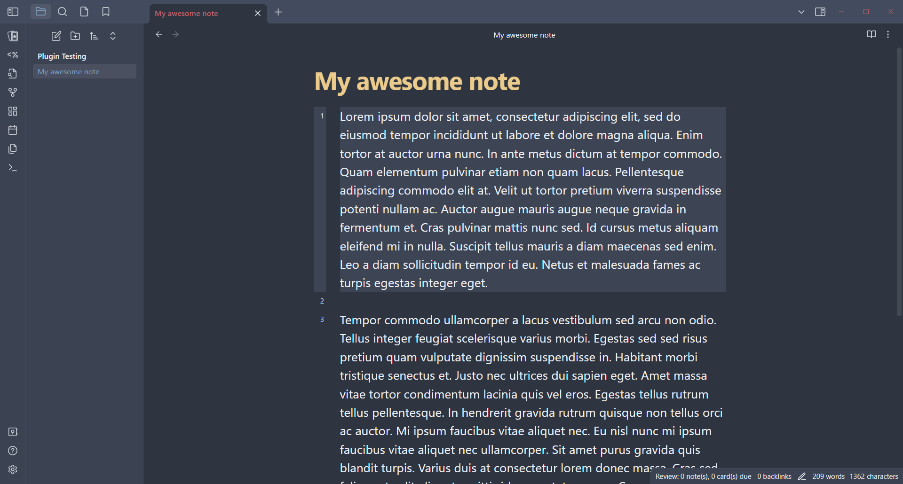
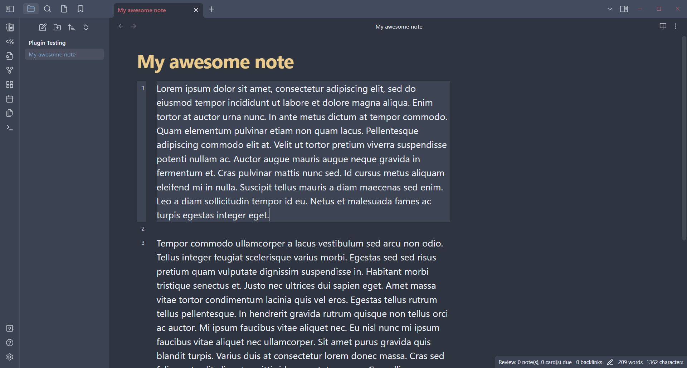

# File Margin Styling
Allows full customisation of the margin of notes, without having to disable the 'Readable line length' setting.

Options for choosing a value and unit for both reading and viewing modes are available.

## Gallery

### Before

### After

## Development

- `git clone https://github.com/speedberg/file-margin-styling.git` to clone this repo 
- `npm install` or `yarn install` to install dependencies
- `npm run dev` or `yarn run dev` to rebuild the plugin

## Licence
This plugin is licenced under the [MIT licence](LICENCE.md).